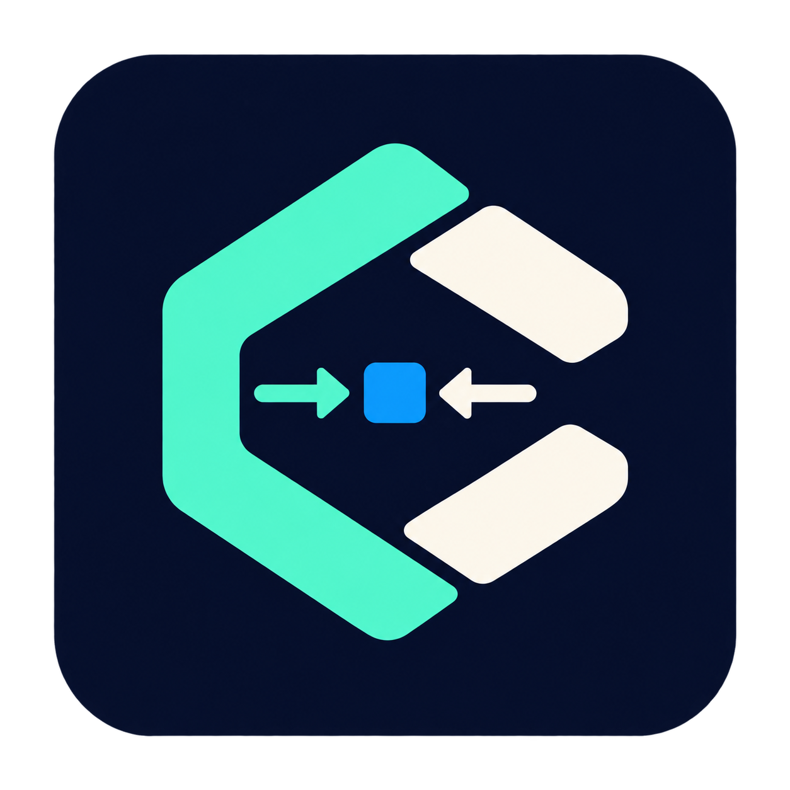

<p align="center">
  
</p>

<h1 align="center">gpt-codex-client</h1>

<p align="center">
  <strong>OpenAI SDK-style Python client for ChatGPT/Codex OAuth-backed workflows.</strong>
</p>

<p align="center">
  English · <a href="README.zh-CN.md">简体中文</a> ·
  <a href="https://pypi.org/project/gpt-codex-client/">PyPI</a> ·
  <a href="https://hc-zhou.github.io/gpt-codex-client/">Docs</a>
</p>

<p align="center">
  <a href="https://pypi.org/project/gpt-codex-client/"></a>
  <a href="https://pypi.org/project/gpt-codex-client/"></a>
  <a href="LICENSE"></a>
  <a href="https://github.com/HC-Zhou/gpt-codex-client/actions/workflows/ci.yml"></a>
</p>

`gpt-codex-client` is an OpenAI SDK-style Python client for ChatGPT/Codex
OAuth-backed workflows. It is intentionally not an API-key client for
`api.openai.com`; it uses a local token cache compatible with
`~/.codex/auth.json` and requires an account that can access the relevant
ChatGPT/Codex backend.

## Install

```bash
uv add gpt-codex-client
```

## Quick Start

```python
from gpt_codex_client import CodexClient

with CodexClient(no_browser=True) as client:
    response = client.responses.create(
        model="gpt-5.5",
        input="Write a short Python function that reverses a string.",
    )
    print(response.output_text)
```

## Highlights

- Responses-style sync and async clients with streaming support.
- Chat Completions compatibility for existing message/tool-call workflows.
- OAuth PKCE login, refresh tokens, and `~/.codex/auth.json` token cache support.
- Model discovery from the public OpenAI Codex model registry.
- Optional Pydantic parsing for structured output.

## List Models

`client.models.list()` reads the public OpenAI Codex model registry from the
`openai/codex` GitHub repository instead of the ChatGPT/Codex backend `/models`
endpoint.

```python
from gpt_codex_client import CodexClient

with CodexClient() as client:
    models = client.models.list()
    for model in models:
        print(model.id)
```

The registry source is:

```text
https://raw.githubusercontent.com/openai/codex/main/codex-rs/models-manager/models.json
```

Set `GPT_CODEX_CLIENT_MODELS_MANIFEST_URL` or pass `models_manifest_url=` to
use another compatible registry.

## Authentication

The client lazily authenticates on the first request. By default it reads and
writes `~/.codex/auth.json` with `0600` permissions.

```python
from gpt_codex_client import login

login(no_browser=True)
```

The default OAuth client id follows the ChatGPT/Codex sign-in flow used by the
official Codex clients. If OpenAI issues a different client id for your app, set
`GPT_CODEX_CLIENT_OAUTH_CLIENT_ID` or pass `auth_client_id=` to `CodexClient`.

For automation, pass a `login_handler` that receives the authorization URL and
returns the final redirect URL:

```python
from gpt_codex_client import login

token = login(login_handler=lambda url: input(f"Open {url}\nRedirect URL: "))
```

## Responses

```python
with CodexClient() as client:
    response = client.responses.create(
        model="gpt-5.5",
        input="Summarize this repository.",
        reasoning={"effort": "medium"},
        text={"verbosity": "low"},
    )
```

Streaming returns a context manager and iterator:

```python
with CodexClient() as client:
    with client.responses.create(model="gpt-5.5", input="Say hi", stream=True) as stream:
        for event in stream:
            if event.type == "response.output_text.delta":
                print(event.data.get("delta"), end="")
```

## Structured Output

Install the optional extra when using Pydantic models:

```bash
uv add "gpt-codex-client[pydantic]"
```

```python
from pydantic import BaseModel
from gpt_codex_client import CodexClient

class Result(BaseModel):
    title: str

parsed = CodexClient().responses.parse(
    model="gpt-5.5",
    input="Return JSON with a title.",
    text_format=Result,
)
print(parsed.parsed.title)
```

## Chat Compatibility

The chat compatibility layer converts Chat Completions-style messages and
function tools into Responses requests:

```python
completion = CodexClient().chat.completions.create(
    model="gpt-5.5",
    messages=[{"role": "user", "content": "Hello"}],
)
print(completion.choices[0].message.content)
```

## Development

```bash
uv sync --all-extras --dev
uv run pytest -q
```

## Protocol reliability (0.2.0)

Inference opening retries now honor max_retries for streamed and aggregated calls.
Stream failures expose partial results through StreamError; EOF without a terminal
event is an error. Chat tool calls use id/type/function format and include argument
deltas and accurate finish reasons. Optional preserve_context retains opaque
Codex context for same-model replay. See [streaming](docs/streaming.md),
[Chat migration](docs/chat-compatibility.md), and [native replay](docs/responses.md).
Validation uses offline MockTransport fixtures, not live OAuth/Codex calls.

## Session caching and usage

Responses and Chat calls (sync/async) accept `session_id`, `prompt_cache_key`, and
`transport="sse" | "websocket" | "auto"`. SSE remains the default; WebSocket is
optional via `pip install 'gpt-codex-client[websocket]'`. Supply full history and
keep a stable session ID to enable transparent incremental requests.

Read `response.usage.input_tokens`, `.cached_tokens`, `.cache_write_tokens`,
`.output_tokens`, `.reasoning_tokens`, and `.total_tokens` when usage is present.
Missing counters remain `None`; input totals include cached tokens.

The client owns its bounded internal connection cache, without a public Session
object. Use `close_session(id)` / `await aclose_session(id)` or close the client
to release its WebSockets. See [Responses documentation](docs/responses.md#cache-identity-and-optional-websocket-transport)
for lifecycle, concurrency, recovery, optional-dependency and proxy details.
Cache hits and cost savings are not guaranteed. Automated regression tests use offline mocks; the protocol document below separately records a real synchronous WebSocket/SSE case.

See the [live protocol capture](docs/protocol.md) for actual requests, responses, tool results and usage.

## GPT reasoning effort

```python
response = client.responses.create(
    model="gpt-5.5",
    input="Explain the trade-offs in this design.",
    model_reasoning_effort="high",
)
```

`model_reasoning_effort` maps to the wire field `reasoning.effort`; it is not
sent as a top-level protocol field. It works with sync/async Responses `create`,
`parse`, streaming, and `chat.completions.create`. Existing `reasoning={"effort":
"high", "summary": "auto"}` and Chat `reasoning_effort="high"` remain supported.
Matching duplicate values are accepted; conflicting values raise `ValueError`
before network I/O. Other reasoning options are preserved without mutating inputs.

Omitting the option keeps the backend default. Non-empty strings are passed
through without model-name filtering or a hard-coded capability list; supported
levels depend on the model and backend. The [Codex configuration reference](https://developers.openai.com/codex/config-reference/)
documents `minimal`, `low`, `medium`, `high`, and model-dependent `xhigh`.
This SDK does not read `model_reasoning_effort` from local Codex TOML automatically.
