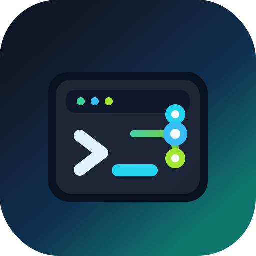

<p align="center">
  
</p>

<h1 align="center">gpt-codex-client</h1>

<p align="center">
  <strong>面向 ChatGPT/Codex OAuth 工作流的 OpenAI SDK 风格 Python 客户端。</strong>
</p>

<p align="center">
  <a href="README.md">English</a> · 简体中文 ·
  <a href="https://pypi.org/project/gpt-codex-client/">PyPI 软件包</a> ·
  <a href="https://hc-zhou.github.io/gpt-codex-client/">文档</a>
</p>

<p align="center">
  <a href="https://pypi.org/project/gpt-codex-client/"></a>
  <a href="https://pypi.org/project/gpt-codex-client/"></a>
  <a href="LICENSE"></a>
  <a href="https://github.com/HC-Zhou/gpt-codex-client/actions/workflows/ci.yml"></a>
</p>

`gpt-codex-client` 是一个 OpenAI SDK 风格的 Python 客户端，用于
ChatGPT/Codex OAuth 登录支持的工作流。它不是面向 `api.openai.com` 的
API Key 客户端；它读取和写入兼容 `~/.codex/auth.json` 的本地 token 缓存，
并要求账号具备对应 ChatGPT/Codex 后端访问权限。

## 安装

```bash
uv add gpt-codex-client
```

## 快速开始

```python
from gpt_codex_client import CodexClient

with CodexClient(no_browser=True) as client:
    response = client.responses.create(
        model="gpt-5.5",
        input="Write a short Python function that reverses a string.",
    )
    print(response.output_text)
```

## 亮点

- 提供 Responses 风格的同步和异步客户端，并支持流式输出。
- 提供 Chat Completions 兼容层，便于迁移已有 messages/tool calls 代码。
- 支持 OAuth PKCE 登录、refresh token 和 `~/.codex/auth.json` token 缓存。
- 从 OpenAI Codex 公开模型注册表读取模型列表。
- 可选支持 Pydantic 结构化输出解析。

## 获取模型列表

`client.models.list()` 会读取 OpenAI Codex 仓库中的公开模型注册表，
而不是调用 ChatGPT/Codex 后端的 `/models` 接口。

```python
from gpt_codex_client import CodexClient

with CodexClient() as client:
    models = client.models.list()
    for model in models:
        print(model.id)
```

模型注册表来源：

```text
https://raw.githubusercontent.com/openai/codex/main/codex-rs/models-manager/models.json
```

如果需要使用其他兼容的注册表，可以设置
`GPT_CODEX_CLIENT_MODELS_MANIFEST_URL`，或在构造客户端时传入
`models_manifest_url=`。

## 认证

客户端会在首次请求时懒加载认证。默认读取并写入 `~/.codex/auth.json`，
保存权限为 `0600`。

```python
from gpt_codex_client import login

login(no_browser=True)
```

默认 OAuth client id 与官方 Codex 客户端使用的 ChatGPT/Codex 登录流程一致。
如果你有自己的已注册 client id，可以设置 `GPT_CODEX_CLIENT_OAUTH_CLIENT_ID`，
或在构造 `CodexClient` 时传入 `auth_client_id=`。

自动化场景可以传入 `login_handler`，它会收到授权 URL，并返回最终 redirect URL：

```python
from gpt_codex_client import login

token = login(login_handler=lambda url: input(f"Open {url}\nRedirect URL: "))
```

## Responses

```python
with CodexClient() as client:
    response = client.responses.create(
        model="gpt-5.5",
        input="Summarize this repository.",
        reasoning={"effort": "medium"},
        text={"verbosity": "low"},
    )
```

流式调用会返回 context manager 和 iterator：

```python
with CodexClient() as client:
    with client.responses.create(model="gpt-5.5", input="Say hi", stream=True) as stream:
        for event in stream:
            if event.type == "response.output_text.delta":
                print(event.data.get("delta"), end="")
```

## 结构化输出

使用 Pydantic 模型时安装可选 extra：

```bash
uv add "gpt-codex-client[pydantic]"
```

```python
from pydantic import BaseModel
from gpt_codex_client import CodexClient

class Result(BaseModel):
    title: str

parsed = CodexClient().responses.parse(
    model="gpt-5.5",
    input="Return JSON with a title.",
    text_format=Result,
)
print(parsed.parsed.title)
```

## Chat 兼容层

Chat 兼容层会把 Chat Completions 风格的 messages 和 function tools
转换为 Responses 请求：

```python
completion = CodexClient().chat.completions.create(
    model="gpt-5.5",
    messages=[{"role": "user", "content": "Hello"}],
)
print(completion.choices[0].message.content)
```

## 开发

```bash
uv sync --all-extras --dev
uv run pytest -q
```
